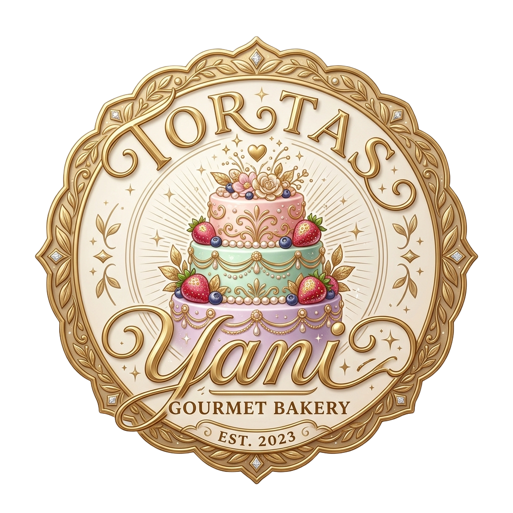

<div align="center">
  

  # 🎂 Tortas Yani - Web Application
  
  **Plataforma Web E-Commerce y Sistema de Gestión para Repostería Artesanal**

  [](https://angular.dev/)
  [](https://www.typescriptlang.org/)
  [](https://sass-lang.com/)
  [](https://rxjs.dev/)
  [](LICENSE)

  <p align="center">
    <i>Una aplicación web moderna, intuitiva y elegante diseñada para la venta y gestión de pasteles artesanales con integración de IA, pasarela de pago simulada y panel de administración en tiempo real.</i>
  </p>

  ---
</div>

## 📌 Tabla de Contenidos

- [✨ Características Principales](#-características-principales)
- [🛠️ Tecnologías Utilizadas](#️-tecnologías-utilizadas)
- [📁 Estructura del Proyecto](#-estructura-del-proyecto)
- [🚀 Guía de Instalación y Paso a Paso](#-guía-de-instalación-y-paso-a-paso)
- [🔗 Integración con el Backend (.NET API)](#-integración-con-el-backend-net-api)
- [👤 Cuentas de Prueba (Acceso Rápido)](#-cuentas-de-prueba-acceso-rápido)
- [📄 Licencia](#-licencia)

---

## ✨ Características Principales

### 🛒 **Experiencia para Clientes (Customer Portal)**
- **Catálogo Interactivo**: Filtrado por categorías (Tortas Temáticas, Postres, Eventos) con precios dinámicos por tamaño.
- **Carrito de Compras**: Gestión de ítems en tiempo real con cálculo automático de totales.
- **Checkout Inteligente**: Integración de mapa interactivo (Leaflet/Nominatim) para geolocalización de entrega y generador de pago QR.
- **Asistente Virtual con IA (Yani Bot)**: Chat conversacional integrado con el modelo Groq para asesorar a los clientes en sus pedidos.
- **Perfil de Usuario**: Historial de pedidos y gestión de datos personales.

### 🛡️ **Panel de Administración (Admin Dashboard)**
- **Dashboard Estadístico**: Indicadores KPI clave, ingresos totales, pedidos pendientes e inventario.
- **Gestión de Productos (CRUD)**: Creación, edición, eliminación y subida de fotos mediante Cloudinary.
- **Gestión de Pedidos**: Control de estados (*Pendiente, En Preparación, Listo, Entregado*).
- **Gestión de Usuarios**: Administración de roles (*Cliente / Administrador*) y cuentas de usuario.

---

## 🛠️ Tecnologías Utilizadas

| Categoría | Tecnología |
| :--- | :--- |
| **Framework Frontend** | Angular 22.1 (Standalone Components & Signals) |
| **Lenguaje** | TypeScript 6.0 |
| **Estilos** | SCSS Vanilla + CSS Grid & Flexbox + Glassmorphic Design |
| **Enrutamiento y Guards** | Angular Router con AuthGuard y AdminGuard |
| **Servicios HTTP & Estado** | RxJS + Angular Signals + HttpClient |
| **Mapas & Geocodificación** | Leaflet JS + OpenStreetMap Nominatim API |
| **Almacenamiento Multimedia** | Cloudinary API |
| **IA / Chatbot** | Groq OpenAI API Integration |

---

## 📁 Estructura del Proyecto

```text
tortas_yani_web/
├── public/                     # Recursos estáticos (Favicon, Logo HD)
├── src/
│   ├── app/
│   │   ├── core/               # Modelos, Guards y Servicios globales
│   │   │   ├── guards/         # authGuard, adminGuard
│   │   │   ├── models/         # Interfaces (User, Product, Order, etc.)
│   │   │   └── services/       # AuthService, ProductsService, CartService, ChatService...
│   │   ├── pages/              # Módulos de páginas
│   │   │   ├── admin/          # Dashboard, Productos, Pedidos, Usuarios
│   │   │   ├── auth/           # Login & Registro (Diseño Split Glassmorphism)
│   │   │   └── customer/       # Home, Cart, Checkout, Chat, Profile
│   │   └── shared/             # Componentes reutilizables (Header, Footer, etc.)
│   ├── styles.scss             # Estilos globales y sistema de tokens CSS
│   ├── main.ts                 # Punto de entrada de la aplicación
│   └── index.html              # HTML Principal
├── angular.json                # Configuración del CLI de Angular
├── package.json                # Dependencias del proyecto
└── tsconfig.json               # Configuración de TypeScript
```

---

## 🚀 Guía de Instalación y Paso a Paso

Sigue estos pasos para clonar, instalar y ejecutar el proyecto en tu máquina local:

### 1️⃣ **Requisitos Previos**
Asegúrate de tener instalado en tu sistema:
- **Node.js** (Versión 18.x o superior) -> [Descargar Node.js](https://nodejs.org/)
- **npm** (Viene junto con Node.js) o `pnpm` / `yarn`
- **Angular CLI** (Opcional, pero recomendado):
  ```bash
  npm install -g @angular/cli
  ```

---

### 2️⃣ **Clonar el Repositorio**
Abre tu terminal y ejecuta:
```bash
git clone https://github.com/junn-shadow/TortasYaniweb.git
cd TortasYaniweb
```

---

### 3️⃣ **Instalar Dependencias**
Instala todos los paquetes requeridos por el proyecto:
```bash
npm install
```

---

### 4️⃣ **Ejecutar el Servidor de Desarrollo**
Inicia el servidor local de Angular:
```bash
npm start
```
*O usando Angular CLI:*
```bash
ng serve -o
```

Una vez ejecutado, abre tu navegador e ingresa a:
👉 `http://localhost:4200`

---

### 5️⃣ **Compilación para Producción (Build)**
Para generar el paquete optimizado de producción:
```bash
npm run build
```
Los archivos optimizados se generarán en la carpeta `dist/tortas_yani_web`.

---

## 🔗 Integración con el Backend (.NET API)

La aplicación web está configurada por defecto para consumir el backend en la URL:
`http://localhost:8080/api`

### 💡 **Modo Offline (Fallback)**
Si el backend no está corriendo localmente, **Tortas Yani Web** cuenta con un sistema inteligente de fallback con datos mock almacenados localmente para permitir probar la navegación, inicio de sesión y gestión de catálogo sin interrupciones.

---

## 👤 Cuentas de Prueba (Acceso Rápido)

Para probar la plataforma en modo Administrador o Cliente:

| Rol | Correo Electrónico | Contraseña |
| :--- | :--- | :--- |
| **Administrador** | `admin@gmail.com` | `admin123` |
| **Cliente** | `carla@gmail.com` | `carla123` |
| **Cliente** | `roberto@gmail.com` | `roberto123` |

---

## 📄 Licencia

Este proyecto se encuentra bajo la Licencia **MIT**. Consulta el archivo `LICENSE` para más información.

<div align="center">
  <sub>Desarrollado con ❤️ para <b>Tortas Yani</b></sub>
</div>
